# Hey, I'm Abdelilah MORTAKI 👋

### 🧠 AI / Full-Stack Developer · 🤖 Multi-Agent Systems · ⚙️ Developer Tooling

---

## 🧠 What I'm building

- 🤖 **AI-assisted developer tooling** — agentic workflows, orchestration, automation, and developer experience.
- 🧩 **Multi-agent migration systems** — working on Angular/Java modernization pipelines at **CGI**.
- 🏗️ **Full-stack products** — from web and mobile surfaces to APIs, data, infrastructure, and automation.
- 🚀 **[EGAWILLDOIT](https://github.com/egawilldoit)** — tools built for myself first, then shared for anyone who finds them useful.

## 🧰 Stack I reach for

  

---

## 🚦 Live Build Radar

> A live engineering-motion view across my public repos and **EGAWILLDOIT**. The profile engine refreshes every 6 hours from repository commits, push recency, PR activity, branches, releases, and public GitHub events.

  

<b>📡 Open live scoring details</b>

 

<!-- BUILD_STAGES:START -->
**Motion index:** `██████░░░░` **62/100** across the 8 hottest public builds

**30-day pulse:** **1401 commits** · **40 PRs touched** · **34 branches** · **1 releases**

🚀 **4** hot · 🔥 **1** shipping · 🟢 **0** active · 🟡 **0** cooling · ⚪ **40** quiet

**Active stack signal:** `TypeScript` ×3 · `JavaScript` ×1 · `TeX` ×1

| Project | Stage | Score | 30d commits | 30d events | Last push | Lang |
| --- | --- | ---: | ---: | ---: | --- | --- |
| [`token-observatory`](https://github.com/egawilldoit/token-observatory) | **🚀 Hot** | **100** | 193 | 43 | today | `TypeScript` |
| [`ega-skills`](https://github.com/egawilldoit/ega-skills) | **🚀 Hot** | **100** | 181 | 134 | today | `JavaScript` |
| [`Ega-House-Platform`](https://github.com/egawilldoit/Ega-House-Platform) | **🚀 Hot** | **100** | 732 | 99 | today | `TypeScript` |
| [`Rapport-Pfe-2026`](https://github.com/MORTAKI0/Rapport-Pfe-2026) | **🚀 Hot** | **100** | 168 | 24 | 1 day ago | `TeX` |
| [`demo_frontend`](https://github.com/MORTAKI0/demo_frontend) | **🔥 Shipping** | **65** | 127 | 0 | 3 days ago | `TypeScript` |
| [`hermes-mobile`](https://github.com/egawilldoit/hermes-mobile) | **⚪ Quiet** | **14** | 0 | 0 | 40 days ago | `TypeScript` |
| [`glow-content-os`](https://github.com/MORTAKI0/glow-content-os) | **⚪ Quiet** | **7** | 0 | 0 | 74 days ago | `TypeScript` |
| [`pod-store-shopify`](https://github.com/MORTAKI0/pod-store-shopify) | **⚪ Quiet** | **7** | 0 | 0 | 90 days ago | `Liquid` |

Motion score is derived from public GitHub signals: up to 45 points for push recency, 25 for commits in the last 30 days, and 30 for recent public events. It measures current engineering motion, not product maturity or production readiness.
<!-- BUILD_STAGES:END -->

---

## 🚀 EGAWILLDOIT

> **Build useful tools. Run them myself. Open them up when they can help someone else.**

<!-- EGA_STATS:START -->
| 🗂️ Public repos | ⭐ Stars | 🍴 Forks | ⚡ Moving | 📈 Avg velocity |
| ---: | ---: | ---: | ---: | ---: |
| **6** | **1** | **1** | **3** | **52/100** |

**Freshest builds:** [`token-observatory`](https://github.com/egawilldoit/token-observatory) · [`ega-skills`](https://github.com/egawilldoit/ega-skills) · [`Ega-House-Platform`](https://github.com/egawilldoit/Ega-House-Platform)
<!-- EGA_STATS:END -->

  
  

<table>
<tr>
<td width="50%" valign="top">

### 🏠 [EGA House Platform](https://github.com/egawilldoit/Ega-House-Platform)

Productivity platform spanning a **Next.js web app**, **Expo mobile app**, agent-facing task APIs, and an autonomous-delivery runner.

`Next.js` · `TypeScript` · `Expo` · `Supabase` · `Agents`

[**Repository →**](https://github.com/egawilldoit/Ega-House-Platform) · [**Live →**](https://www.egawilldoit.online/)

</td>
<td width="50%" valign="top">

### 📱 [Hermes Mobile](https://github.com/egawilldoit/hermes-mobile)

Mobile companion for the **Hermes self-hosted AI automation agent** — bringing the agent workflow closer to a real mobile surface.

`TypeScript` · `Mobile` · `AI Automation`

[**Repository →**](https://github.com/egawilldoit/hermes-mobile)

</td>
</tr>
</table>

**More from EGA:** [🤖 AI Quota Pool Tracker](https://github.com/egawilldoit/AI-Quota-Pool-Tracker) · [🛒 Shop POC](https://github.com/egawilldoit/shoppoc-app)

---

## 🧩 Selected builds

<table>
<tr>
<td width="50%" valign="top">

### ⏱️ [DoItTimer](https://github.com/MORTAKI0/doittimer)

Task planning, focus sessions, and daily productivity stats in a server-first app with Supabase-backed auth and data.

`Next.js 16` · `React 19` · `TypeScript` · `Supabase` · `Playwright`

</td>
<td width="50%" valign="top">

### 🎬 [ClipFlow](https://github.com/MORTAKI0/clipflow)

Content automation that schedules TikTok and Instagram videos to Pinterest through Buffer, backed by a FastAPI downloader.

`Next.js` · `FastAPI` · `Buffer` · `Cloudflare R2`

</td>
</tr>
</table>

**More public work:** [🧠 AI Text Detector](https://github.com/MORTAKI0/AI_Text_Detector) · [🧬 Brain Tumor CNN](https://github.com/MORTAKI0/brain_tumor_detection_cnn) · [📊 Moroccan Economy DWH](https://github.com/MORTAKI0/Moroccan_Economy_DWH_WEBAPP) · [🏦 eBank](https://github.com/MORTAKI0/ebank-backend)

---

## 📊 GitHub pulse

  

  
  

  

  

---

## ⚡ Recent public activity

<!-- RECENT_ACTIVITY:START -->
- 🌱 Created branch `abmortaki/ega-588-w6spec-006-build-servestdio-mcp-server-skeleton-and-protocol` in [`egawilldoit/ega-skills`](https://github.com/egawilldoit/ega-skills) — _Sep 05, 2026_
- 🔀 Merged PR [**#16 feat: add OpenCode Go Tracker V1**](https://github.com/egawilldoit/token-observatory/pull/16) in [`egawilldoit/token-observatory`](https://github.com/egawilldoit/token-observatory) — _Sep 05, 2026_
- ⚡ Updated [`egawilldoit/token-observatory`](https://github.com/egawilldoit/token-observatory) — _Sep 05, 2026_
- ⚡ Updated [`egawilldoit/Ega-House-Platform`](https://github.com/egawilldoit/Ega-House-Platform) — _Sep 03, 2026_
- 🚀 Published release [**v1.0.0**](https://github.com/egawilldoit/ega-skills/releases/tag/v1.0.0) in [`egawilldoit/ega-skills`](https://github.com/egawilldoit/ega-skills) — _Sep 05, 2026_
- 🌱 Created branch `wave/06-mobile-runtime-audit` in [`egawilldoit/Ega-House-Platform`](https://github.com/egawilldoit/Ega-House-Platform) — _Sep 03, 2026_
<!-- RECENT_ACTIVITY:END -->

---

### 🛠️ Build systems · 🚀 Ship useful things · ⚡ Automate the boring parts

**[MORTAKI0](https://github.com/MORTAKI0)** · **[EGAWILLDOIT](https://github.com/egawilldoit)**

