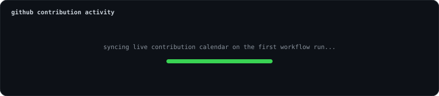
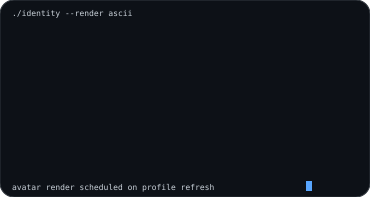
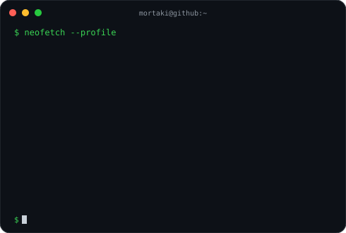

<div align="center">

<h3><code>mortaki@github ~ $ ./contributions.sh</code></h3>



<br><br>

<h3><code>mortaki@github ~ $ whoami</code></h3>

<table>
<tr>
<td valign="top" width="370"></td>
<td valign="top" width="490"></td>
</tr>
</table>

</div>

### <code>mortaki@github ~ $ cat focus.txt</code>

```text
AI-assisted developer tooling
Agentic workflows and multi-agent systems
Full-stack products, APIs, data and automation
Building useful tools under EGAWILLDOIT
```

### <code>mortaki@github ~ $ ls ./shipping</code>

- [`egawilldoit/Ega-House-Platform`](https://github.com/egawilldoit/Ega-House-Platform) — productivity platform and agent-facing workflows.
- [`egawilldoit/ega-skills`](https://github.com/egawilldoit/ega-skills) — skills, MCP tooling and agent infrastructure.
- [`egawilldoit/ShipLoop`](https://github.com/egawilldoit/ShipLoop) — delivery orchestration from idea to verified release.
- [`egawilldoit/token-observatory`](https://github.com/egawilldoit/token-observatory) — tooling around AI/token usage visibility.

### <code>mortaki@github ~ $ echo $STACK</code>

`TypeScript` · `Python` · `Java` · `Next.js` · `React` · `FastAPI` · `Spring` · `Supabase` · `PostgreSQL` · `Linux` · `GitHub Actions`

<div align="center">

<sub>Profile art is generated in this repository. No hosted profile-stats service, no JavaScript, no personal access token.</sub>

</div>
